# Javascript DOM

## Using js command on browser devtools

This article is about javascript DOM and its commands. Also in this article we will see
some images to help us understand better these concepts.

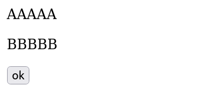

> Here we have a HTML page, very simple

The HTML code is that below

```html

<!DOCTYPE html>
<html lang="en">
<head>
    <meta charset="UTF-8">
    <meta http-equiv="X-UA-Compatible" content="IE=edge">
    <meta name="viewport" content="width=device-width, initial-scale=1.0">
    <title>Document</title>
</head>
<body>
    <div class="hi">
        <p>AAAAA</p>
        <p>BBBBB</p>
        <button>ok</button>
    </div>
</body>
</html>

```

Now we going to press control + shift + i (firefox browser), that shortcut will open a devtools window, and using that tool, we will use the console and write some javascript codes and manipulate the DOM.

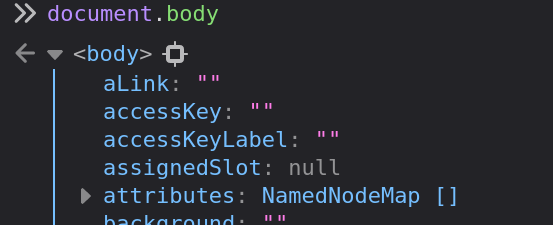

> When we put `document.body`, we are able to see a lot information about body tag

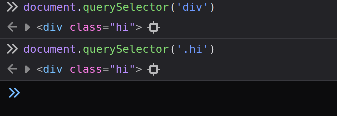

> Using these commands we can access the tag div. the `querySelector` its like getElementBy(Id, TagName, ClassName)

Now we going to add a background inside the div tag, using the querySelector and we will
make it by the class name:

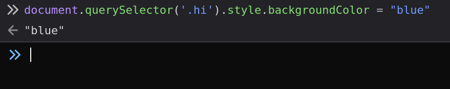

And now we will see, how the document html was modificated:


And we also can be able to see the childrens of the div.hi 

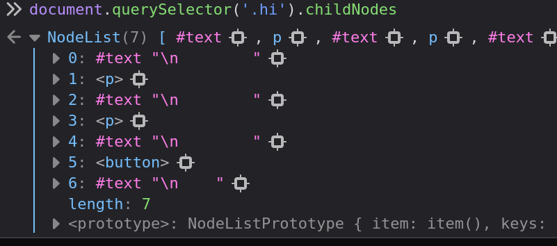

---

## Change a attribute

```html
<div class="hi" style="background-color: green; height: 200px; width: 200px;" >

```

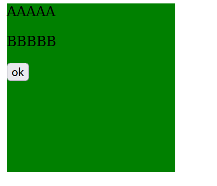

> We change the html code, adding a background color and sizes

And now, we will change these values using the DOM manipulation:

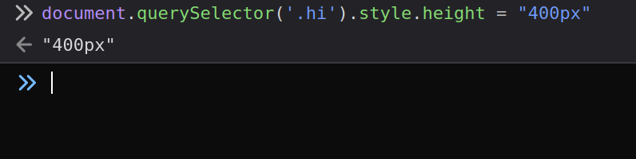

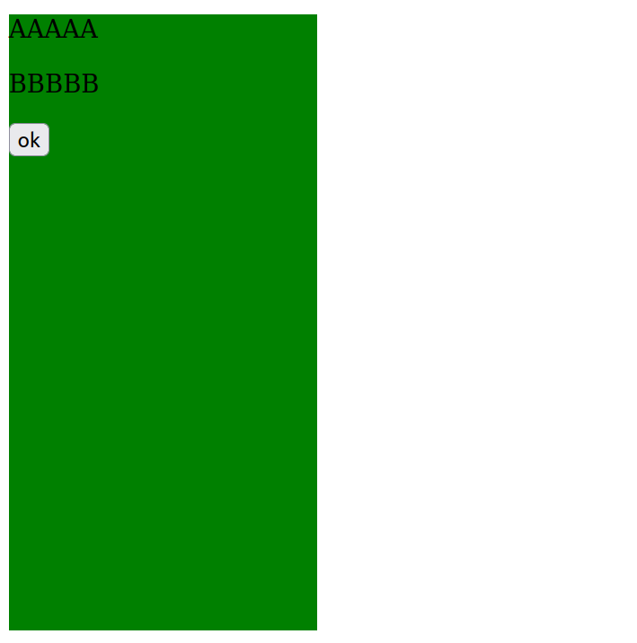

---

## Change the class name

Now we going to change a little bit our code HTML:

```html
<body>
    <div class="hi colorA"> <!-- here -->
        <p>AAAAA</p>
        <p>BBBBB</p>
        <button>ok</button>
    </div>
</body>

<style> /* and adding this style tag */
    .hi{
        height: 200px;
        width: 300px;
    }
    .colorA{
        background-color: rgb(185, 233, 116);
    }
    .colorB{
        background-color: rgb(232, 133, 66);
    }
</style>

```

And now our document

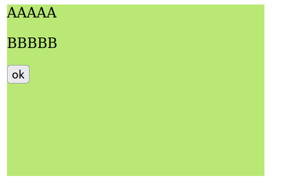

Now we going to change the class name colorA to colorB

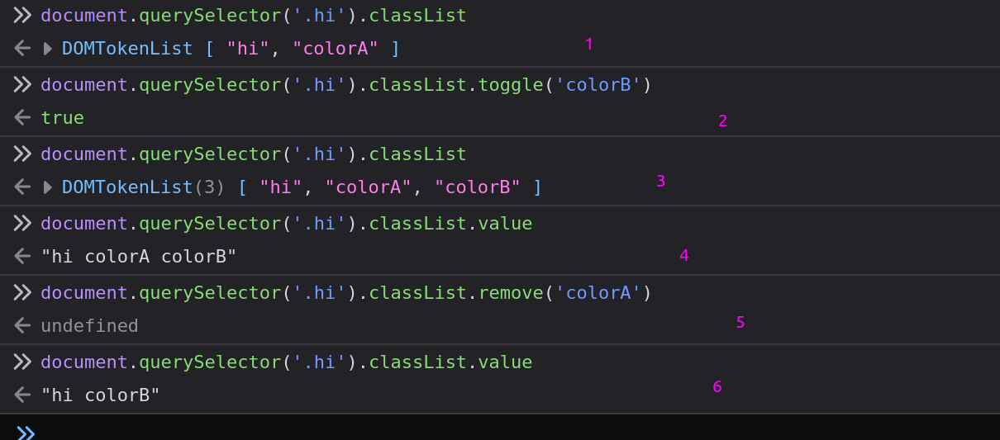

> As we can see in the image above, (1) in this command we are able to check our classList
when we will see all class name that exist. (2) here we will toggle the class name `colorA`
to `colorB`, but (3)(4) our classList has colorA and colorB, and now (5) we will remove the
colorA and (6) let only colorB in our classList

And our document:

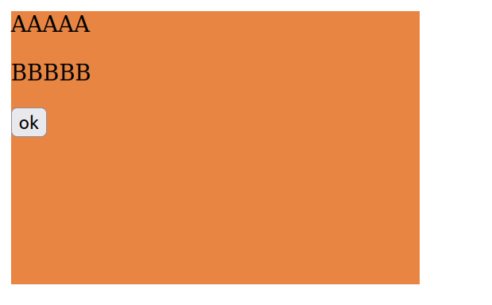
> The change already is create in the (2) command