# Create a cinema DB with Sqlite

Here we will create a simple database about cinema, films, movies.

We will create the tables:

* movies
* persons
* actors
* directors

Well, the database will be simple, so, we will not add a lot table in this project. 

In the `persons` table we will add just users, because those users can be actors, directors, or both. In this table we will add a column `id` and `name`.

In the `movies` table, we will add all movies. In this table we will add a column `id` and `title`.

In the `actors` table, we will add the column `id`, `id_peoples` and `id_movies`.

In the `directors` table, we will add the column `id`, `id_peoples` and `id_movies`.

## Persons table

Using [DB Browser](https://sqlitebrowser.org/) and [Sqlite](https://www.sqlite.org/index.html) technologies, we will create the person table:

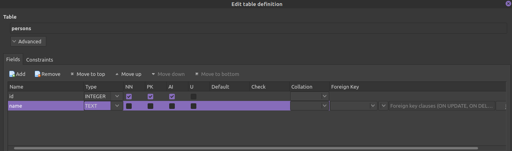

> This is the graphical way to create the table in DB Browser

```sql
CREATE TABLE "persons" (
	"id"	INTEGER NOT NULL,
	"name"	TEXT,
	PRIMARY KEY("id" AUTOINCREMENT)
);

```
> The sqlite code

We now will analyze this code above. We are creating the columns of the table, so, the id column is INTEGER, and that means, in this column only will accept numeric values, and also this column is NOT NULL, always it needs have a value. The id column is a Primary Key and AUTOINCREMENT, that means the id column is a ID literally, and automatically the id number will be added when we populate a row.

The name column is TEXT, that means, in this columns only will accept a textual or string values. If a number is added in this column, that will be a string number symbol and that number will be not able to be used in arithmetic operations.

Check [here](https://www.sqlite.org/datatype3.html) all the column types


## Movies table

```sql
CREATE TABLE "movies" (
	"id"	INTEGER NOT NULL,
	"title"	TEXT,
	PRIMARY KEY("id" AUTOINCREMENT)
);

```

## Actors table

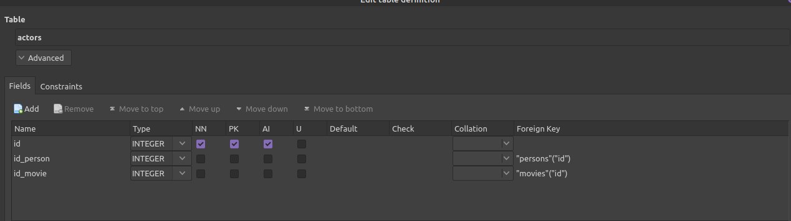

> The graphical way to create the table in DB Browser

```sql
CREATE TABLE "actors" (
	"id"	INTEGER NOT NULL,
	"id_person"	INTEGER,
	"id_movie"	INTEGER,
	FOREIGN KEY("id_person") REFERENCES "persons"("id"),
	FOREIGN KEY("id_movie") REFERENCES "movies"("id"),
	PRIMARY KEY("id" AUTOINCREMENT)
);

```

In this table we can see the FOREIGN KEY, and what is this? First we create the id column, and then the foreign id column, for example the `id_person` and `id_movie`. The id_person column and id_movie are foreign key column, that column will receive a id from another table (the Primary key ID from another table).

The id_movie, for example, will receive the Primary key ID from the table movies, and the same logic to the id_person column. This line `FOREIGN KEY("id_person") REFERENCES "persons"("id"),` means, the id_person is a foreign key and that column makes a reference to ID Primary Key from the table persons. Therefore the id_person column is connected to ID column from the persons table, and the same logic to the column id_movie.

## Directors table

```sql
CREATE TABLE "directors" (
	"id"	INTEGER NOT NULL,
	"id_person"	INTEGER,
	"id_movie"	INTEGER,
	FOREIGN KEY("id_person") REFERENCES "persons"("id"),
	FOREIGN KEY("id_movie") REFERENCES "movies"("id"),
	PRIMARY KEY("id" AUTOINCREMENT)
);

```

## Add content

Using DB Browser we will add contents in all the tables.

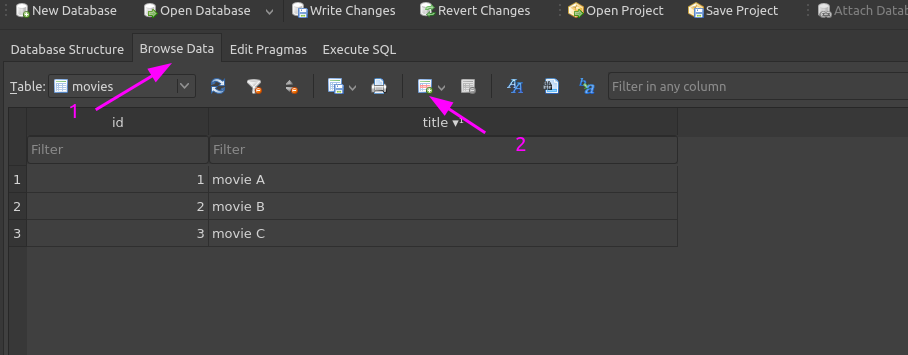

> To add content in your table using DB Browser, just click (1) to browse data and then (2) to add a new row.

Here in the table actors and also directors, we just need to add the id from an movie and an id from a actor already registered in the actors and movies tables.

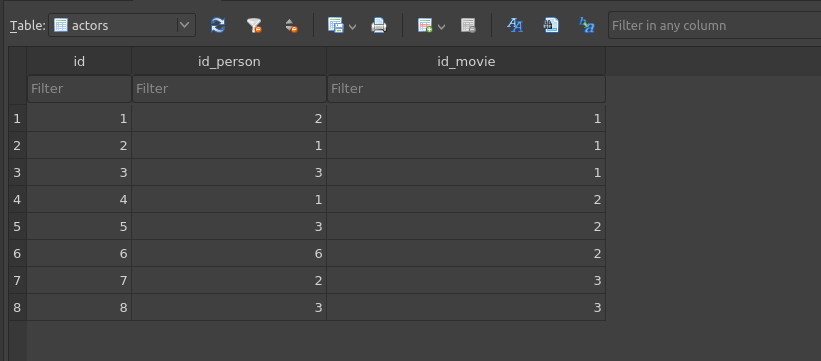

## Retrieve the data

Ok, we already populate all the tables, now we will check the data in them.

Going to the `Execute SQL` button, is this area we will write sqlite codes, and make a query:


And now, let's check each table:

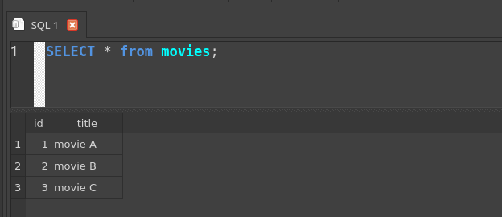

---

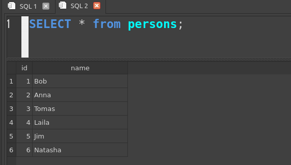

---

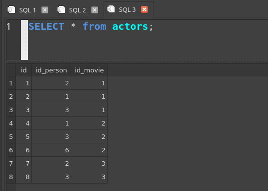

---

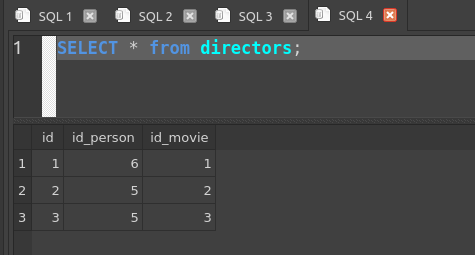

Now we will create a more detailed query, and we will join tables. 

## Detailed query and Join tables

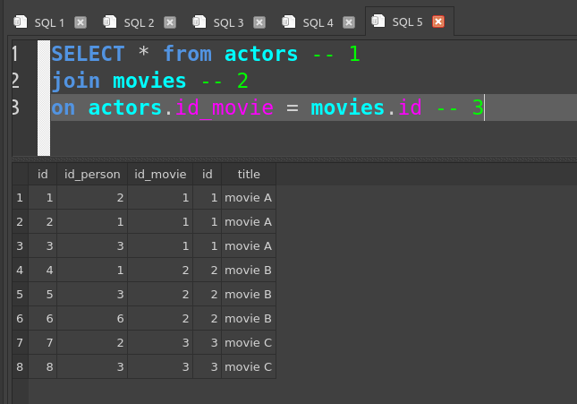

> In this picture above, we can see the code and the table output. In the line (1) we will select (or show) all column from the table actors. The line (2) we will join the table movies. The line (3) we will especify that the number in the column id_movie foreign key from the table actors, needs be equal to the primary key number id from the movies table.

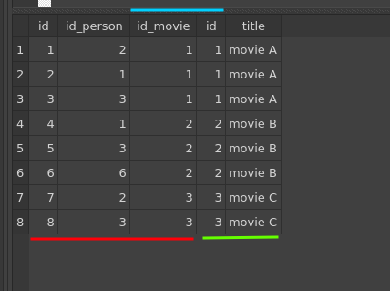

> In this picture above, the line red indicates the actors table, the line green indicates the movies table, and the line blue show us that the id_movie from the actors table and the id from the movies table, both have the same number.

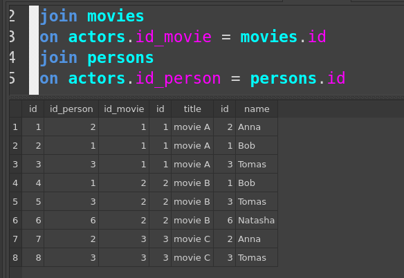

> The picture above, now we add the persons table, and as we can see, the id number from the persons table is equal to the id_person from the actors table.

Now we are going to clean that joined tables. We will take out these id columns.

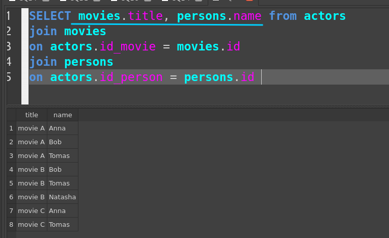

> We can especify the columns that we want to see.

The same logic can be applied to the directors table.
